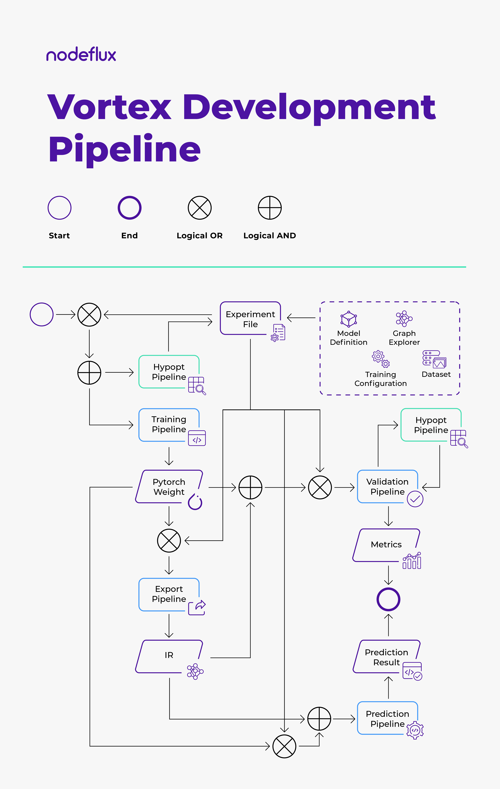

<p align='center'></p>

# Vortex ( Visual-Cortex )

A Deep Learning Model Development Framework for Computer Vision

Key Features :

- Easy CLI usage
- Modular design, reusable components
- Various architecture support
    - 50 + infamous backbone networks
    - Classification and Detection architecture support ( Detection models are yet to be verified, may produce bad results )
- Integration with image augmentation library ( [Albumentations](https://albumentations.readthedocs.io/en/latest/) )
- Integration with hyperparameter optimization library ( [Optuna](https://optuna.org/) )
- Integration with 3rd party experiment logger ( [Comet.ml](https://www.comet.ml/site/) )
- Graph export to [Torchscript](https://pytorch.org/docs/stable/jit.html) and [ONNX](https://onnx.ai/)
- Visual report of model's performance and resource usage, see [this example](experiments/outputs/resnet18_softmax_cifar10/reports/resnet18_softmax_cifar10_validation_cuda:0.md)

## User Guides & Documentations

- see [Vortex Documentation](https://nodefluxio.github.io/vortex/)

## Development Pipelines



## Developer Guides

### Run Unit Tests (with coverage)
- run `pytest` with `htmlcov` report :
```
pytest tests/
```
### Run CLI tools Tests :
- see [tests/cli/README.md](tests/cli/README.md)